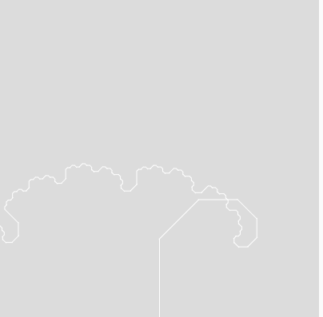

## Introduction

This project has the goal of making a fractal tree. From the get-go lets
explain what is a fractal. Well, a fractal is the infinite repetition of a
certain pattern, in this particular case our pattern is the "Y" symbol. This
concept may not seem clear now but it will be soon, so don't worry. Now that
you know what a fractal is, a fractal tree is simply a fractal that makes a
tree as it is being created. Okay, after this basic explanation lets get it
started!


At the end of this tutorial you will obtain the power to make one of these,
incredible don't you think?

### Setup

#### Web Browser

Software that lets you access the internet, some examples of web browsers are:

* Google Chrome
* Mozilla Firefox
* Microsoft Edge
* Safari
* Opera

And so many others, but these are more common.

#### Text Editor / Web Editor

So, as a writer needs his pen and paper, you need your own tools, in your case,
you need an editor. What is an editor, you may ask. Well, it's the place where
the magic happens, where you write your code, where you fail, where you
sometimes (most of them) rage but, mainly, where you succeed. Even though it's
hard to hustle, never give up and keep up! In the long run, it will be worth
it. Some examples of text editors are the following:

* [Sublime Text 3](https://www.sublimetext.com/3)
* [Visual Studio Code](https://code.visualstudio.com/)
* [Atom](https://atom.io/)
* [Notepad++](https://notepad-plus-plus.org/download/)

And there are a million others, have fun searching for them...

### Basics

For this project, you will need some acquired knowledge. Since this tutorial is
amazing, the knowledge will be given for free.

**Note:** To define/use functions you need to call them, that's pretty simple,
here is a small example.

```javascript
function whatever() {

}
```

Obviously, this function does nothing because it has nothing inside.

#### CreateCanvas

Just like painting you need some sort of place to be your canvas. Like the name
suggests, lets create one. So, what do you do to use this function? Basically,
call `createCanvas` with the desired parameters. Firstly you need to pass the
height, followed by the weight, and finally, you have your canvas. So let us
create some art! Yeah, programming is art.

**Note:** Fun fact about the canvas you have just created. It's height grows to
the right, like it usually does, but its weight doesn't grow upwards, like you
are used to. It grows to the opposite side or downwards. Why does it happen?
Well that's a challenge for you to overcome, so take it into account when doing
your tree.

Example:

```javascript
function canvas() {
    createCanvas(200,200);
}
```

In this example the canvas has a 200x200 dimension.

#### Background

Since a blank canvas is boring and programming is not, you need to give it a
little bit of life. To do so, you use a background that allows editing your
canvas color from 0 to 256, 0 being black and 256 white, respectively.

Example:

```javascript
function color() {
    background(0);
}
```

The background is now Black.

#### Line

With your "base" now set, lets learn how to draw. In this case we will be
drawing lines, so what do you need to draw a line? Simple answer, exactly two
points, so give the function two points (height, weight) and let "line" do its
job, unite those points. See? As easy as it can be.

**Note:** Take into account that you need to give one point and then another so
take into consideration you only have two coordinates.

Example:

```javascript
function draw() {
    line(0,0,10,10);
}
```

Here, the first point is (0,0), the second one is (10,10) and line unifies
both.

#### Translate

Did you ever wan to change the origin of the axis from the good old (0,0) to
whatever origin you wish? Well, `translate` make your dreams come true. What's
the point, you may ask yourself. Later on, while creating your tree, you will
understand so take this into account, it will help you a lot.

Example:

```javascript
function translation() {
    translate(10,10);
}
```

Origin of the axis is now at (10,10).

#### Rotate

Almost done with to the Basics and to end it, nothing better than rotate.
Rotate allows you to rotate the axis, the rotation made is based on the angle
passed as a parameter.

Example:

```javascript
function rotation() {
    rotate(PI/4);
}
```

The axis is now rotated 45 degrees.

You are now ready to start coding!

## Start

Since starting line must be somewhere this time is with `createCanvas` and
background (explained before) thats given out even before you even think about
it.

```javascript
function setup() {
    createCanvas(400, 400);
}

function draw() {
    background(220);
}
```

The "Base" is now ready to improvement so the first step to make the tree
happen is to draw its trunk, well to do it lets use line but where should you
do it? Since canvas size is a 400x400 let do it in the bottom middle of canvas
that is 200x200 with 100 lengths and to make it simpler to understand let's
make another function with it and call it to branch later will be useful so
just make it now.

```javascript

function setup() {
    createCanvas(400, 400);
}

function draw() {
    background(220);
    stroke(255);
    branch();
}

function branch() {
    line(200, 400, 200, 300);
}

```

Don't give too much importance to stroke is simply the color desired for the
line in this case white.

If everything is done correctly it should look like this:


The trunk is now established next step is to draw branches to do so using a
variable is optimal, since lots of branches will be needed and to make the tree
do it recursively is the way to go so how do you do it? First and foremost to
define a variable you do it inside the parentheses of the function you want
that variable to be into in this case its branch, let's name it `len` since it
will define the length of branches lets try then to write the same code but now
with the variable `len`.

```javascript
function setup() {
    createCanvas(400, 400);
}

function draw() {
    background(220);
    stroke(255);
    branch(100);
}

function branch(len) {
    line(200, 400, 200, 400 - len);
}
```

Note: when calling branch, 100 is the value of `len` using variables is now on
skill list but drawing lines from a specific point in this case from (200, 400)
to (200, 300) its a pain since the goal is to draw a tree recursively so a
simple way to do it is simply starting to draw from the axis origin and then
define a pattern so what should you use to do so ? The answer here is
translated defining axis origin the middle bottom then starting to make the
tree grow from there but by doing this you also need to chance line because
it's no more a specific point but the axis origin much easier right?

```javascript
function setup() {
    createCanvas(400, 400);
}

function draw() {
    background(220);
    stroke(255);
    translate(200, 400);
    branch(100);
}

function branch(len) {
    line(0, 0, 0, -len);
}
```

**Note:** remember that axis is inverted so `len` must be negative thats why
its `-len`.

## Development

Trunk is fixed and strong to grow big so lets do it, lets draw branches to the
tree but going straight ahead its not very treatable, lets go sideways then
seems good to do so you need to change the angle you will draw onto, rotate is
the way to go but just for testing measures lets only go to the right now that
rotate is used there only one thing left before draw the branch what is ?
Correct moving the axis origin to the trunk's top by using translate again, now
all conditions are met let's draw branches.

```javascript
function setup() {
    createCanvas(400, 400);
}

function draw() {
    background(220);
    stroke(255);
    translate(200, 400);
    branch(100);
}

function branch(len) {
    line(0, 0, 0, -len);
    translate(0, -len);
    rotate(PI/4);
    line(0, 0, 0, -len);
}
```


Your tree now has a new branch, yeah but if you really wanna make a real tree
branch as you go up on it will grow smaller so how do you make it possible?
Simple see how you did line again well that basically doing branch function so
instead of doing line just call branch with a smaller value or by other means
multiply the initially given number by another smaller than 1 let use 0.7 here.

```javascript
function setup() {
    createCanvas(400, 400);
}

function draw() {
    background(220);
    stroke(255);
    translate(200, 400);
    branch(100);
}

function branch(len) {
    line(0, 0, 0, -len);
    translate(0, -len);
    rotate(PI/4);
    branch(len * 0.7);
}
```

This code above generated the following:


Well, its no surprise there's no limitation/condition to make it stop when it
created an infinite loop and eventually went boom,so lets make a stop point so
eventually it stops and don't explodes anymore, in order for it to happen use
if parentheses and inside the condition you want for branch to stop here lets
use `len > 4` implement the if condition before with branch inside and it will
stop when `len` is minus or equal to 4 in this case, so lets try it.

```javascript
function setup() {
    createCanvas(400, 400);
}

function draw() {
    background(220);
    stroke(255);
    translate(200, 400);
    branch(100);
}

function branch(len) {
    line(0, 0, 0, -len);
    translate(0, -len);
    rotate(PI/4);
    if (len > 4) {
        branch(len * 0.7)
    }
}
```


See it didn't go boom anymore but if you want to adjust the angle without
changing it every single time,first lets make the angle a variable so its
easier to adjust for so making a slider is the way to go, how do you make a
slider you ask use `createSlider` after in parentheses obviously (take into
account that `createSlider` needs four arguments), firstly in the first two
arguments you put the slider range here it will be from 0 to 180 (from this
point onwards lets stop using radiants and start to use degrees, for it use
`angleMode(DEGREES)`, it sets the angle to degrees, if you have difficulties
doing so click [here](https://en.wikipedia.org/wiki/Radian)), then on the third
argument put the starting point here is 45 and finally how much you want to
move by changing the slider 1 seems okay here, so lets implement this to the
code.

```javascript
let angle;
let slider;

function setup() {
    createCanvas(400, 400);
    angleMode(DEGREES);
    slider = createSlider(0, 180, 45, 1);
}

function draw() {
    background(220);
    angle = slider.value();
    stroke(255);
    translate(200, 400);
    branch(100);
}

function branch(len) {
    line(0, 0, 0, -len);
    translate(0, -len);
    rotate(angle);
    if (len > 4) {
      branch(len * 0.7);
}
```

In case you are wondering `angle = slider.value();` is simply saying the
slider created is applied to the angle range also let is used to define the
variable name instead of creating a function easier and most important less
work.

Rightsize is now done so to do left side is simply rotating to the opposite
side by doing -angle and calling branch again everything on the if condition
made before.

```javascript
let angle;
let slider;

function setup() {
    createCanvas(400, 400);
    angleMode(DEGREES);
    slider = createSlider(0, 180, 45, 1);
}

function draw() {
    background(220);
    angle = slider.value();
    stroke(255);
    translate(200, 400);
    branch(100);
}

function branch(len) {
    line(0, 0, 0, -len);
    translate(0, -len);

    if (len > 4) {
      rotate(angle);
      branch(len*0.7);
      rotate(-angle);
      branch(len * 0.7
    }
}
```



It still doesn't work.

## Conclusion

Why it seemed so right? Remember `translate` it is his fault since you
always changed the "starting" point to the top of the branch it doesn't come
back to make it to the left side instead goes always right and makes the
pattern only there making, a funny but not intended result. To solve this
problem is quite easy use push and pop, push saves the initial position that
you were before applying the if condition then you do branch like usually and
when the if condition makes you stop you pop, it means you go back to the state
saved in push, up to this point you have only done the right side of the tree
now for the left side just push and pop again but this time to the negative
angle and magic will happen.

```javascript
let angle;
let slider;

function setup() {
    createCanvas(400, 400);
    angleMode(DEGREES);
    slider = createSlider(0, 180, 45, 1);
}

function draw() {
    background(220);
    angle = slider.value();
    stroke(255);
    translate(200, 400);
    branch(100);
}

function branch(len) {
    line(0, 0, 0, -len);
    translate(0, -len);
    if (len > 4) {
        push();
          rotate(angle);
          branch(len*0.7);
        pop();
        push();
          rotate(-angle);
          branch(len * 0.7
        pop();
    }
}
```


Your hard work paid off the tree is finally done this is a basic one now that
you have this basic knowledge how to make a fractal tree try to improve it
making a Christmas tree or give your imagination/creativity wings and fly
create your own and unique tree now that you are up to the challenge go and
fly.

